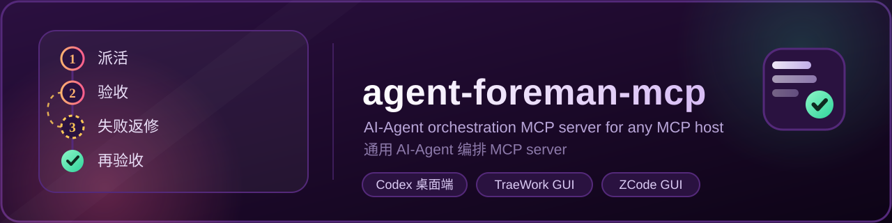

<div align="center">



<br/>


# agent-foreman-mcp

**A general-purpose AI-Agent orchestration MCP server for any MCP host**

Registered as a standard MCP server by the host of your choice (Claude Desktop / Cursor / ZCode / Cline / Windsurf, …), it dispatches external AI-Agents (Codex desktop, TraeWork / TRAE SOLO CN and ZCode, all driven through their desktop UIs over CDP) to drive the closed loop of **project development → acceptance → failure rework → re-acceptance**.

Visual acceptance (with optional AI content validation): [English guide](docs/visual-acceptance.en.md) · [Validation status](docs/visual-validation.en.md)

<br/>

[](https://github.com/lanlan0811/agent-foreman-mcp/actions/workflows/ci.yml)
[](https://www.npmjs.com/package/agent-foreman-mcp)
[](https://www.npmjs.com/package/agent-foreman-mcp)
[](LICENSE)
[](https://www.typescriptlang.org/)
[](https://nodejs.org/)
[](https://github.com/modelcontextprotocol/sdk)

**English** · [简体中文](README.md)

</div>

---

## What this is

The **host** (any MCP host) is the commander; this MCP server is the **scheduler + execution surface + objective acceptance gate**; the external AI-Agent (Codex / TraeWork / ZCode GUI) is the "worker" that does the development. The server itself is **not tied to any particular host** — any MCP host supporting the stdio transport can connect to it; see the [Host Integration Guide](docs/host-integration.en.md).

- **11 MCP tools**: `run_task / continue_task / query_task / list_tasks / get_task_report / cancel_task / verify_task / rework_task / get_profiles`, plus `prepare_visual_baseline / approve_visual_baseline` for visual acceptance.
- **Dual-track results**: every result is delivered both as "human-readable text + a `---agent-foreman-meta---` JSON block" and as the MCP-standard `structuredContent` — the same fields from a single source of truth. Legacy hosts can regex the text block; modern hosts consume the structured object directly. Tools declare an `outputSchema`, and field names are stable and **add-only**.
- **Async contract**: `run_task` returns a `taskId` immediately; long-running work is polled via `query_task` (never blocks `tools/call`).
- **Objective acceptance**: automated command checks (typecheck/lint/test/build, skipped when absent, derived from the tech stack) + programmatic code analysis (change list / diffstat / suspicious markers such as TODO, debugger statements, credential-like values), all relative to the **git baseline**, with no automatic commit/stash. The acceptance engine is **fail-closed**: a test command exiting 0 while reporting zero test cases is a failure; git projects require changes relative to the pre-work baseline unless `"requireChanges": false` is set in `.agent-foreman/acceptance.json` (for read-only/analysis tasks).
- **Check parallelism**: command checks run with **bounded parallelism** (`verifyConcurrency`, default 2, range 1–4). When checks have ordering dependencies (a later check reads build output, uses `--fix`, or shares a cache dir) set it to `1` for fully serial execution; the project-level `.agent-foreman/acceptance.json` can override the server-level `config.json`. Report and log formats are unchanged (results are returned in declared order).
- **Failure-rework loop**: automatic rework (`autoFixRounds`) plus manual `rework_task`; on acceptance failure a repair-plan document is generated (by default inside the project at `.agent-foreman/plans/`) and fed back to the agent; when rounds run out the task goes to `needs_attention` for the host to decide.
- **Execution surface**: `driver: "gui"` is driven by an explicit adapter controlling the desktop UI (Codex / TraeWork / ZCode each use an isolated CDP flow); `driver: "spawn"` runs an external CLI child process.
- **Project-less dispatch (ZCode)**: `run_task`'s `projectPath` may be omitted — ZCode then takes the task in its `default` workspace, skipping project registration/import, Git baseline, project snapshot, project lock and project acceptance (the terminal state is annotated structurally as `verificationNotApplicable: "no_project"`, and `verify_task`/`get_task_report` return a not-applicable note). The companion `allowCreateProject: false` stops dispatch before any import side effect when the target directory is not registered. See the [ZCode CDP adapter](docs/zcode-cdp.en.md).
- **Scheduling discipline**: a serial queue per project plus a global concurrency cap (default 2, configurable).
- **Optional AI content validation (off by default)**: validates whether the **content** of an image or page screenshot matches an expectation you declared explicitly. The judgement is fully **delegated to a local command you provide** (the MCP never reads, stores or forwards credentials and embeds no model client); it is **warning-only by default** and can be upgraded to failing per rule; majority-vote sampling plus a task-level cache debounces verdicts, and an inconclusive or below-threshold vote yields `uncertain` (which never blocks or triggers rework). Configuration and command contract: [visual acceptance](docs/visual-acceptance.en.md).
- **Never touches credentials**: each agent uses its own login state; this server stores and forwards no API keys. The optional AI content validation introduces no credential management either — the judging command owns its own secrets (see [SECURITY.en.md](SECURITY.en.md)).
- **Extensible**: a new agent = one profile (data) plus, if needed, one adapter file — no changes to the orchestration core.
- **Want the internals?** See [ARCHITECTURE.en.md](ARCHITECTURE.en.md) (layering, module boundaries, state machine, acceptance pipeline, extension points and known gaps).

## Quick start

### Prerequisites

| Item | Requirement |
|---|---|
| Node.js | ≥ 20 (CI covers 20 / 22 / 24) |
| Package manager | npm (the repo ships `package-lock.json`) |
| OS | Windows / macOS / Linux (verified by the three-platform CI matrix) |

The driven agents are installed separately as needed: Codex desktop / TraeWork (TRAE SOLO CN) / ZCode desktop (GUI-driven), or the codex CLI (headless path, below). **This server needs none of their credentials.**

### Install the npm package

```bash
npm i -g agent-foreman-mcp
# or run it without installing
npx -y agent-foreman-mcp
```

### Connect your host

Add a stdio server entry to your host's MCP configuration (the key depends on the host, usually `mcpServers`):

```json
{
  "mcpServers": {
    "agent-foreman": {
      "command": "npx",
      "args": ["-y", "agent-foreman-mcp"]
    }
  }
}
```

For each host (Claude Desktop / Cursor / ZCode / Cline / Windsurf) — exact config locations, environment variables, smoke steps and FAQ — see the **[Host Integration Guide](docs/host-integration.en.md)**.

### Build from source

```bash
npm ci
npm run build          # produces dist/
node dist/index.js     # starts over stdio (normally launched by the host, no need to run manually)
```

Development and gate commands: `npm run dev`, `npm run typecheck`, `npm run lint`, `npm test`, `npm run check:stdio` (strictly verifies that stdout carries MCP protocol messages only).

### Data directory

Defaults to `~/.agent-foreman` (override with the `AGENT_FOREMAN_HOME` environment variable); created automatically on first start. Project-level acceptance config lives **inside the project** at `<project>/.agent-foreman/acceptance.json`.

## Tool surface (11 tools)

| Tool | Capability / approval | Purpose |
|---|---|---|
| `run_task` | write + approval | Dispatch work (optionally with auto-verify / auto-rework); returns a `taskId` asynchronously |
| `continue_task` | write + approval | Resume the original session of a `needs_user` task |
| `query_task` | read | Poll status / progress / log tail |
| `list_tasks` | read | Filtered task history |
| `get_task_report` | read | Full text of a round's acceptance report (`report.md`) |
| `cancel_task` | write + approval | Cancel a running task: CLI agents get their process tree killed; GUI agents are stopped by clicking through CDP with a bounded wait for idleness (`gui.cancelWaitMs`, default 15s), and the terminal state states plainly when stop was not confirmed |
| `verify_task` | read | Run acceptance once against a task or project path (never modifies source) |
| `rework_task` | write + approval | Manual rework (feeds the failure report back to the same agent) |
| `get_profiles` | read | Inspect agent adapters and executable probe results |
| `prepare_visual_baseline` | write + approval | Capture or import reference images, producing a candidate and summary for review |
| `approve_visual_baseline` | write + approval | After user review, verify the digest and write the baseline plus an approval record |

> **Dual-track return values**: human-readable text + a `---agent-foreman-meta---` JSON block (easy for hosts to regex), delivered alongside the MCP-standard `structuredContent` carrying the same fields (consumed directly by modern hosts). Error paths also provide `structuredContent` (at least `ok:false` and `message`).

> **Approval is enforced by the host**: the "write + approval" column is metadata exposed to the host (`_meta.requireApproval` / `annotations`); **the annotation is not a security boundary** — actual authorization control must come from the host.

> **Path safety gate**: `projectPath` is validated on submission — it must be absolute, the directory must exist, and symlinks are normalized via realpath (the receipt states the resolution source). The home directory itself and system/root-level directories are rejected outright, so a worker's write permission can never cover an entire system subtree. When a git repo has uncommitted changes the receipt carries a co-existence warning.

> **Project-less dispatch** (ZCode only): when `projectPath` is omitted the task runs in ZCode's `default` workspace, skipping project registration, Git baseline, project snapshot, project lock and project acceptance (terminal state annotated `not_applicable: no_project`). `allowCreateProject=false` forbids auto-importing unregistered projects. See [docs/zcode-cdp.en.md](docs/zcode-cdp.en.md).

## Logging & stdio contract

This server is a standard MCP **stdio server** and respects the transport contract strictly:

- **stdout carries MCP JSON-RPC messages only.** No diagnostic log is ever written to stdout — that would corrupt the JSON-RPC stream and break handshakes or tool calls in strict clients.
- **All log levels (DEBUG/INFO/WARN/ERROR) go to stderr**, and are appended to `logs/server.log` in the data directory (UTF-8, ISO timestamps, level tags).
- So **`INFO`/`WARN` on stderr does not mean the server is failing**; it is normal diagnostics. Only a startup failure (`agent-foreman-mcp 启动失败:`) is fatal, and it exits with a non-zero code.

The data directory defaults to `~/.agent-foreman` (override with `AGENT_FOREMAN_HOME`), and the log file is `<data dir>/logs/server.log`. Diagnose connection problems from `server.log`; do not conclude the server is unhealthy merely because stderr has output.

## Skill self-install

On startup the server idempotently syncs its bundled orchestration skill into **`~/.agents/skills/agent-foreman-mcp/`** (the Agents Skills open standard, user level):

- matching content hash → skipped; otherwise the old version is backed up as `.bak-<timestamp>` before overwriting;
- an install failure only **warns and never blocks** the server;
- that directory is resolved from `os.homedir()` and is **not affected by `AGENT_FOREMAN_HOME`**;
- disable it with `--no-skill-install` or `AGENT_FOREMAN_NO_SKILL_INSTALL=1`.

The skill docs (SKILL.md / usage-examples.md) live in the repo under `skills/agent-foreman-mcp/` and cover the tool surface, task-brief templates, the full meta field table, the error-code reference and rework phrasing templates.

## Documentation

| Document | Contents |
|---|---|
| [docs/host-integration.en.md](docs/host-integration.en.md) | **Host integration guide**: generic `mcpServers` config, per-host locations, env vars, smoke steps, FAQ |
| [ARCHITECTURE.en.md](ARCHITECTURE.en.md) | **Architecture**: layering and module boundaries, startup wiring, data directory, state machine, acceptance and rework pipeline, agent driver contract, GUI instance lifecycle, cross-platform strategy, security red lines, extension points, known gaps |
| [HANDOFF.md](HANDOFF.md) | Project handover document: current-state snapshot, architecture tour, hard red lines, known limitations, takeover advice |
| [docs/agent-profiles.en.md](docs/agent-profiles.en.md) | agent profiles field reference + real-machine samples |
| [docs/adapter-matrix.en.md](docs/adapter-matrix.en.md) | Agent capability research matrix (Codex / ZCode / TraeWork / extension slots) |
| [docs/acceptance-config.en.md](docs/acceptance-config.en.md) | Project-level acceptance config (`.agent-foreman/acceptance.json`) reference |
| [docs/visual-acceptance.en.md](docs/visual-acceptance.en.md) | Visual acceptance: screenshot comparison, image specs, baseline approval and freezing, AI content validation |
| [docs/visual-validation.en.md](docs/visual-validation.en.md) | Verification scope and coverage boundaries for visual acceptance (CI matrix as the source of truth) |
| [docs/codex-gui-cdp.en.md](docs/codex-gui-cdp.en.md) | Codex desktop GUI driver: MSIX COM activation, CDP takeover, selectors, liveness detection, acceptance and rework |
| [docs/traework-cdp.en.md](docs/traework-cdp.en.md) | TraeWork GUI driver (CDP): principles, configuration, mode switching, selectors, security red lines |
| [docs/zcode-cdp.en.md](docs/zcode-cdp.en.md) | ZCode GUI driver: install probing, exact project/model, full-access mode, pause/resume, acceptance and rework |
| [docs/npm-publish-guide.md](docs/npm-publish-guide.md) | Release process (gates, versioning, credentials, post-publish verification, GitHub Release) |
| [CONTRIBUTING.en.md](CONTRIBUTING.en.md) | Dev environment, engineering standards, commit and release flow, how to add an agent |
| [SECURITY.en.md](SECURITY.en.md) | Security model (zero credential management / command allow-list / process and desktop-automation boundaries) and private reporting channel |
| [CODE_OF_CONDUCT.en.md](CODE_OF_CONDUCT.en.md) | Contributor code of conduct |
| [CHANGELOG.en.md](CHANGELOG.en.md) | Version change log |
| [LICENSE](LICENSE) | Apache License 2.0 (see the section below) |

## Agent support status

| agentId | driver / adapter | status | Notes |
|---|---|---|---|
| `codex` | `gui` / `codex-gui` | **ready** (`research` on macOS) | Codex desktop GUI (Windows: MSIX COM activation + CDP; macOS: spawn the .app + CDP); supports `model`/`reasoningLevel`/`planDoc`/`designSystem`; wait-for-user detection, cancel and re-dispatch guards are all verified on real hardware. Verified on Windows; the basic macOS loop is verified but stays `research` until the cancel/rework matrix is complete |
| `zcode` | `gui` / `zcode-gui` | **research** | The CDP GUI adapter is implemented and the Windows loop passes on real hardware; supports the model menu, project binding with read-back hardening, project-less dispatch and `allowCreateProject`; the basic macOS loop is verified but stays `research` until the cancel/rework/new-project matrix is complete |
| `traework` | `gui` / `traework-gui` | **ready** | Drives the TRAE SOLO CN desktop UI over CDP; all three panel modes verified on real hardware |
| `stub` | `spawn` | tests only | `test/stub-agent/stub-agent.mjs` with three plays (good / fix-on-first / never) |

> Adding an agent usually means adding one profile — see [docs/agent-profiles.en.md](docs/agent-profiles.en.md) and [CONTRIBUTING.en.md](CONTRIBUTING.en.md).

## Headless path: codex-cli (user profile)

The built-in `codex` drives the desktop GUI. If you would rather not depend on GUI automation, the **codex CLI headless mode** works without touching server code — add a `driver=spawn` user profile in the data directory.

Prerequisites:

- codex CLI (`npm i -g @openai/codex`). Keep it current: older builds had their signing certificate revoked and macOS Gatekeeper kills them outright (`Killed: 9`).
- Already logged in (`codex login`), reusing the `~/.codex` login state.

`~/.agent-foreman/agent-profiles.json`:

```json
{
  "profiles": {
    "codex-cli": {
      "displayName": "Codex CLI (OpenAI headless)",
      "type": "cli",
      "driver": "spawn",
      "status": "ready",
      "command": null,
      "argsTemplate": ["exec", "<prompt:arg>", "--skip-git-repo-check", "--sandbox", "workspace-write"],
      "promptMode": "arg",
      "cwd": "task",
      "env": {},
      "timeoutMs": 1800000,
      "killTree": "taskkill",
      "authNote": "Reuses the ~/.codex login state; do not combine with --approve-for-me (mutually exclusive in practice)",
      "executableDiscovery": {
        "dirs": ["/opt/homebrew/bin", "/usr/local/bin"],
        "fileNames": ["codex"],
        "fallbackCommand": "codex"
      }
    }
  }
}
```

Use it exactly like a built-in agent:

```text
run_task(projectPath=/path/to/project, agentId=codex-cli, task="task brief", autoVerify=true, autoFixRounds=2)
```

Behaviour and limits:

- `get_profiles` lists `codex-cli` and probes for the `codex` executable on `PATH`.
- The `model` argument has no effect for spawn agents — the CLI uses the default model from `~/.codex/config.toml`; to pin a model, append `"-m", "<model>"` to `argsTemplate`.
- Writes are confined to the project directory by the `workspace-write` sandbox; on POSIX, cancel/timeout escalates SIGTERM→SIGKILL on the process group (`killTree` is ignored on non-Windows platforms).

## Recommended phrasing

> "In project D:\xxx use codex to implement 'the task'. First run run_task(autoVerify:true, autoFixRounds:2), then use query_task to check the result; if the report shows needs_attention, call rework_task with the failing items from get_task_report as feedback and verify again; once everything passes, report the changedFiles and diffstat back to me."

> "In project D:\xxx use traework with mode=Code to implement 'the task'; it switches to Code mode, binds the project, sends the task and auto-verifies, generating a repair plan and reworking on failure."

## Origin and migration

**Origin**: this project descends from **tianshu-mcp v0.5.4** (Apache-2.0) as a **separate, independent fork** and has evolved independently since 1.0.0. The two are **two independently maintained projects**: tianshu-mcp's history (release notes, real-hardware acceptance, milestone narrative) belongs to its own repository, and this repository neither keeps nor retells it; the two projects do not depend on each other and never read each other's data.

**If you are migrating from tianshu-mcp**, note these four user-visible behaviour changes:

1. **The data directory is not shared**: this project's default data directory is `~/.agent-foreman` (environment variable `AGENT_FOREMAN_HOME`). Task history, project registry, agent profiles and configuration under the old `~/.tianshu-mcp` are **neither read nor migrated** — this project starts from a fresh directory.
2. **Project-level acceptance config must be recreated**: this project reads only `<project>/.agent-foreman/acceptance.json` and **does not read** `.tianshu-mcp/acceptance.json`. Existing projects need their config copied to the new path (`.agent-foreman/`).
3. **The Codex GUI profile directory changed**: the Codex desktop's dedicated browser profile moved from `…/tianshu-mcp/codex-gui/profile` to `…/agent-foreman/codex-gui/profile` (under `%LOCALAPPDATA%` on Windows, under `~/.agent-foreman/` on macOS). That directory carries login state, so **the first run requires signing in to Codex again**.
4. **The Codex state backup suffix changed**: the pre-registration backup file suffix is now `.agent-foreman-backup.json`, **and the legacy suffix** `.tianshu-mcp-backup.json` **is still recognized** — if an old backup exists on disk (the clean snapshot from before any tool touched the file), this project **will not overwrite it or create a new backup**, and the log prints whichever path is actually in effect. You can therefore still roll back from the old file.

For the remaining contract changes relative to tianshu-mcp v0.5.4 (new package name, dual-track `structuredContent`, skill install moving to `~/.agents/skills/`, removal of the Gitee integration, …), see [CHANGELOG.en.md](CHANGELOG.en.md).

## Contributing

- **Main repository**: <https://github.com/lanlan0811/agent-foreman-mcp> (GitHub)
- **Feedback**: bugs and feature requests go through the repository issue templates; for security vulnerabilities follow [SECURITY.en.md](SECURITY.en.md) and report privately — do **not** open a public issue.

### Contributors

Thanks to the community members who have contributed to this project (in order of first participation). Some of them contributed during the project's tianshu-mcp era; their contributions carried over with the code:

<table>
  <tr>
    <td align="center"><a href="https://github.com/liuchsong"><br /><sub>liuchsong</sub></a></td>
    <td align="center"><a href="https://github.com/a13612745638"><br /><sub>a13612745638</sub></a></td>
    <td align="center"><a href="https://github.com/king195547"><br /><sub>king195547</sub></a></td>
  </tr>
  <tr>
    <td align="center"><a href="https://github.com/zhaoxc857"><br /><sub>zhaoxc857</sub></a></td>
    <td align="center"><a href="https://github.com/jian-in"><br /><sub>jian-in</sub></a></td>
    <td align="center"><a href="https://github.com/huiliyi37"><br /><sub>huiliyi37</sub></a></td>
  </tr>
</table>

## License

Released under the **Apache License 2.0**; the full legal text is in [LICENSE](LICENSE). Copyright 2026 agent-foreman-mcp contributors.

This project descends from tianshu-mcp (Apache-2.0) as an independent fork; as Apache-2.0 requires, the original copyright, license and disclaimer are retained alongside the LICENSE.

### Rights granted

- **Commercial use**: usable in commercial products and services;
- **Modification**: free to modify the source;
- **Distribution**: free to redistribute original or modified versions;
- **Private use**: usable privately within an organization;
- **Patent use**: contributors grant you a license to any patents covering their contributions (subject to the termination clause below).

### Your obligations

1. **Retain notices**: when distributing, include the full LICENSE text and retain its copyright, license and disclaimer notices;
2. **Mark modifications**: if you modify files, attach a prominent "modified" notice in those files;
3. **Retain NOTICE**: if the original work includes a NOTICE file, retain its contents (this project currently has **no** NOTICE file);
4. **No extra restrictions**: you may not impose additional restrictions on the rights this license grants.

### Not granted / termination

- **Trademarks**: this license grants **no** rights to trademarks, trade names or service marks;
- **Patent termination**: if you initiate patent litigation against this project or its contributors (including cross-claims and counterclaims), the patent license granted to you **terminates automatically**.

### Disclaimer

The software is provided **"as is"**, without warranties or conditions of any kind, express or implied, including but not limited to merchantability, fitness for a particular purpose and non-infringement. In no event shall the authors or copyright holders be liable for any claim, damages or other liability arising from, out of, or in connection with the software or its use or other dealings.

### Third-party licenses

Runtime dependencies are mainly **MIT / ISC / Apache-2.0** licensed and compatible with Apache-2.0:

| Dependency | License | Purpose |
|---|---|---|
| [`@modelcontextprotocol/sdk`](https://github.com/modelcontextprotocol/sdk) | MIT | MCP protocol implementation |
| [`zod`](https://github.com/colinhacks/zod) | MIT | External input validation |
| [`cross-spawn`](https://github.com/moxystudio/node-cross-spawn) | MIT | Cross-platform child processes |
| [`puppeteer-core`](https://github.com/puppeteer/puppeteer) / [`@puppeteer/browsers`](https://github.com/puppeteer/puppeteer) | Apache-2.0 | GUI driving and the managed browser |
| [`pixelmatch`](https://github.com/mapbox/pixelmatch) | ISC | Visual pixel comparison |

Development dependencies (TypeScript, ESLint, Prettier, Vitest, Vite, tsx, …) follow their own licenses and are not shipped in the npm package.

### Relationship to the security boundary

This MCP **never stores, reads or forwards** any AI-Agent API key or login state (see [SECURITY.en.md](SECURITY.en.md)). The license terms do not change that design boundary.
